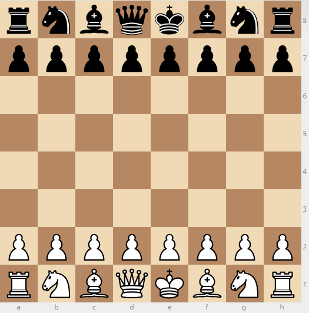

# Schaken

## Introductie
Voor we aan deze opdracht beginnen, willen we benadrukken dat je geen schaakregels hoeft te kennen om te begrijpen wat je hier moet doen. We zullen wat context geven, maar het enige dat je echt moet weten, is dat stukken over het bord bewegen (en je hoeft zelfs niet te weten welke bewegingen/zetten toegelaten zijn).

Een schaakbord bestaat uit 64 (8x8) vakjes. Het spel begint altijd met de volgende opstelling:


We kunnen dit textueel voorstellen op de volgende manier:
```
Rb | Nb | Bb | Qb | Kb | Bb | Nb | Rb
pb | pb | pb | pb | pb | pb | pb | pb
   |    |    |    |    |    |    |
   |    |    |    |    |    |    |
   |    |    |    |    |    |    |
   |    |    |    |    |    |    |
pw | pw | pw | pw | pw | pw | pw | pw
Rw | Nw | Bw | Qw | Kw | Bw | Nw | Rw
```
waarbij de verschillende lettercombinaties de verschillende schaakstukken aanduiden. De eerste letter van het stuk verwijst naar het type stuk:

- K: Koning (King)
- Q: Koningin (Queen)
- R: Toren (Rook)
- B: Loper (Bishop)
- N: Paard (Knight – niet K omdat de Koning al K gebruikt)
- p: pion (pawn)

De tweede letter verwijst naar de speler waartoe het stuk behoort:
- b: zwart (black)
- w: wit (white)

Om het gemakkelijker te maken om over de verschillende posities op het bord te praten, geven we de kolommen een letter en de rijen een nummer:
```
8: Rb | Nb | Bb | Qb | Kb | Bb | Nb | Rb
7: pb | pb | pb | pb | pb | pb | pb | pb
6:    |    |    |    |    |    |    |
5:    |    |    |    |    |    |    |
4:    |    |    |    |    |    |    |
3:    |    |    |    |    |    |    |
2: pw | pw | pw | pw | pw | pw | pw | pw
1: Rw | Nw | Bw | Qw | Kw | Bw | Nw | Rw
   a    b    c    d    e    f    g    h
```
zodat we bijvoorbeeld kunnen zeggen dat de witte koningin (Qw) zich op positie 'd1' bevindt op dit bord (en de zwarte koningin op 'd8').

## Het doel van deze opgave
Het bestand `movements.txt` bevat een reeks schaakstukzetten. In deze opdracht maken we een Python-script dat zo'n bestand kan lezen, deze zetten verwerkt en het resulterende schaakbord wegschrijft naar een bestand zoals `output_board.txt`. Dit een behoorlijk complexe taak, dus laten we bij het begin beginnen.

## Klasse Piece
Laten we eerst een klasse `Piece` maken, die een schaakstuk op het bord vertegenwoordigt. Deze klasse is niet erg ingewikkeld. We moeten enkel in staat zijn om het te initialiseren met zijn specifieke code (zie hierboven).
```
>>> piece = Piece("Kb")
```
Daarna willen we in staat zijn om de code van het stuk op te vragen, maar ook het type van het stuk (de eerste letter) en de speler waartoe het behoort (de tweede letter):
```
>>> piece.code
"Kb"
>>> piece.kind
"K"
>>> piece.player
"b"
```

Met deze eenvoudige klasse voltooid, gaan we verder naar het volgende deel.

## Klasse Board
Daarna hebben we een klasse `Board` nodig die het schaakbord vertegenwoordigt. Bij het aanmaken van een object van deze klasse hoeven we geen specifieke parameters mee te geven:
```
>>> board = Board()
```

### Stukken op het bord plaatsen
De eerste methode die we nodig hebben, is de methode waarmee we een stuk op een specifieke positie op het bord kunnen plaatsen. Hiervoor definiëren we de methode `set_piece`, die een stuk op de opgegeven positie zet. De methode neemt twee argumenten:

- het stuk dat je op het bord wilt plaatsen (vertegenwoordigd door een `Piece`-object)
- de positie op het bord waar je het stuk wilt plaatsen, weergegeven als een string waarbij het eerste teken de kolomletter aangeeft en het tweede teken het rijnummer.
```
>>> board.set_piece(Piece('Qw'), 'd1')
```
In dit voorbeeld hebben we de witte koningin aangemaakt en deze op vakje 'd1' geplaatst, de positie waar ze staat aan het begin van een spel.

### Stukken op het bord identificeren
Dan hebben we natuurlijk ook een methode nodig om te zien welk stuk zich op een bepaalde positie op het bord bevindt. Hiervoor definiëren we de methode `get_piece`, die hetzelfde soort positie-argument gebruikt als `set_piece`.

```
>>> piece = board.get_piece('d1')
>>> piece.code
"Qw"
```

Natuurlijk heb je, om dit allemaal te laten werken, een interne representatie nodig die de verschillende stukken linkt aan hun respectievelijke posities.

> TIP: Er zijn veel manieren om de stukken aan hun posities op het bord te linken. Onze oplossing (die we ook op het examen zullen gebruiken) maakt echter gebruik van één enkele dictionary.

### Het bord initialiseren
Nu we de methoden hebben om stukken op het bord te plaatsen, moeten we ervoor zorgen dat het bord correct wordt geïnitialiseerd. Aangezien elk schaakspel op dezelfde manier begint (zie introductie), willen we dat alle stukken op het bord staan zodra we een `Board`-object aanmaken:
```
>>> board = Board()
>>> board.get_piece('d1')
"Qw"
>>> board.get_piece('d8')
"Qb"
>>> board.get_piece('c2')
"pw"
>>> board.get_piece('c8')
"Nb"
>>> board.get_piece('d4')
None
(etc)
```

### Het schaakbord weergeven
Nu we het schaakbord succesvol hebben geïnitialiseerd, is het tijd om dit bord te kunnen weergeven. Definieer de methode `display_board_state` die simpelweg een string teruggeeft die de huidige staat van het bord weergeeft:
```
>>> print(board.display_board_state())
8: Rb | Nb | Bb | Qb | Kb | Bb | Nb | Rb
7: pb | pb | pb | pb | pb | pb | pb | pb
6:    |    |    |    |    |    |    |
5:    |    |    |    |    |    |    |
4:    |    |    |    |    |    |    |
3:    |    |    |    |    |    |    |
2: pw | pw | pw | pw | pw | pw | pw | pw
1: Rw | Nw | Bw | Qw | Kw | Bw | Nw | Rw
   a    b    c    d    e    f    g    h
```
Merk op dat elke rij begint met het bijbehorende rijnummer en dat de laatste rij enkel de kolomaanduidingen bevat.

### Stukken bewegen
Natuurlijk willen we, zodra het spel begint, stukken kunnen verplaatsen. Hiervoor definiëren we de methode `move_piece`. Deze methode verplaatst een stuk van één positie op het bord naar een andere positie. De methode neemt twee argumenten:

- de startpositie van het stuk dat verplaatst moet worden
- de eindpositie waar het stuk naartoe moet worden verplaatst

Beide positie-argumenten volgen hetzelfde stringformaat als in `get_piece` en `set_piece`.

Dus om de pion van f2 naar f4 te bewegen, kunnen we de methode aanroepen:
```
>>> board.move_piece('f2', 'f4')
```
We kunnen verifiëren dat de pion niet langer op f2 staat...
```
>>> board.get_piece('f2')
None
```
en de pion nu in de plaats op f4 staat:
```
>>> piece = board.get_piece('f4')
>>> piece.code
"pw"
```

We bekomen het volgende schaakbord:
```
>>> print(board.display_board_state())
8: Rb | Nb | Bb | Qb | Kb | Bb | Nb | Rb
7: pb | pb | pb | pb | pb | pb | pb | pb
6:    |    |    |    |    |    |    |
5:    |    |    |    |    |    |    |
4:    |    |    |    |    | pw |    |
3:    |    |    |    |    |    |    |
2: pw | pw | pw | pw | pw |    | pw | pw
1: Rw | Nw | Bw | Qw | Kw | Bw | Nw | Rw
   a    b    c    d    e    f    g    h
```
En wanneer we de pion van e7 naar e5 bewegen,
```
>>> board.move_piece('e7', 'e5')
```
zal het schaakbord er zo uitzien:
```
>>> print(board.display_board_state())
8: Rb | Nb | Bb | Qb | Kb | Bb | Nb | Rb
7: pb | pb | pb | pb |    | pb | pb | pb
6:    |    |    |    |    |    |    |
5:    |    |    |    | pb |    |    |
4:    |    |    |    |    | pw |    |
3:    |    |    |    |    |    |    |
2: pw | pw | pw | pw | pw |    | pw | pw
1: Rw | Nw | Bw | Qw | Kw | Bw | Nw | Rw
   a    b    c    d    e    f    g    h
```

### Vijandige stukken slaan
Als een stuk naar een positie op het bord beweegt die momenteel bezet is door een vijandelijk stuk (een stuk van een andere kleur), wordt dat stuk eenvoudigweg van het bord verwijderd (dit wordt "slaan" genoemd).

Bijvoorbeeld:

1. We kunnen controleren dat e5 momenteel bezet is door een zwarte pion:
```
>>> board.get_piece('e5').code
"pb"
```
2. en dat f4 door een witte pion wordt bezet
```
>>> board.get_piece('f4')
```
3. Wanneer we die witte pion van f4 naar e5 bewegen,
```
>>> board.move_piece('f4', 'e5')
```
4. kunnen we controleren dat die witte pion nu effectief e5 bezet, en dat daardoor de zwarte pion weg is.
```
>>> board.get_piece('e5').code
"pw"
```
5. En dus is f4 nu leeg (omdat de witte pion daarvan wegbewogen is)
```
>>> board.get_piece('f4')
None
```
Dit kunnen we ook weer zien als we het schaakbord weergeven:
```
>>> print(board.display_board_state())
8: Rb | Nb | Bb | Qb | Kb | Bb | Nb | Rb
7: pb | pb | pb | pb |    | pb | pb | pb
6:    |    |    |    |    |    |    |
5:    |    |    |    | pw |    |    |
4:    |    |    |    |    |    |    |
3:    |    |    |    |    |    |    |
2: pw | pw | pw | pw | pw |    | pw | pw
1: Rw | Nw | Bw | Qw | Kw | Bw | Nw | Rw
   a    b    c    d    e    f    g    h
```
Pas the methode `move_piece` zo aan dat deze dit gedrag correct uitvoert.

### Je eigen stukken slaan?
Een stuk verplaatsen naar een vakje dat al bezet is door een stuk van dezelfde speler is niet toegestaan. Dit betekent dat de invoer onjuist was en dat er een `Error` moet worden gegenereerd.

Bijvoorbeeld, wanneer we proberen om de witte koningin één vakje omhoog te verplaatsen (dat momenteel bezet is door een pion van dezelfde kleur), krijgen we:
```
>>> board.move_piece('d1', 'd2')
ValueError: Illegal move: cannot move to friendly territory
```

### Een niet-bestaand stuk verplaatsen
Ook is het niet toegestaan om een stuk te verplaatsen vanaf een positie waar momenteel geen stuk staat. Dit betekent opnieuw dat de invoer onjuist was en dat er een `Error` gegenereerd moet worden.

Bijvoorbeeld, er staat momenteel geen stuk op c4, dus wanneer we proberen om een stuk vanaf dat vakje te verplaatsen, krijgen we een foutmelding:
```
>>> board.move_piece('c4', 'c5')
ValueError: Illegal move: no piece at start position
```

### Meerdere zetten verwerken
We willen in staat zijn om meerdere bewegingen tegelijk te verwerken. Schrijf een methode `process_movements` die een lijst van bewegingen neemt (gedefinieerd als een tuple met de startpositie en de eindpositie) en de stukken over het bord verplaatst (volgens de volgorde van de lijst!).
```
board.process_movements([
    ('c7', 'c5'),
    ('c2', 'c3'),
])
>>> print(board.display_board_state())
8: Rb | Nb | Bb | Qb | Kb | Bb | Nb | Rb
7: pb | pb |    | pb |    | pb | pb | pb
6:    |    |    |    |    |    |    |
5:    |    | pb |    | pw |    |    |
4:    |    |    |    |    |    |    |
3:    |    | pw |    |    |    |    |
2: pw | pw |    | pw | pw |    | pw | pw
1: Rw | Nw | Bw | Qw | Kw | Bw | Nw | Rw
   a    b    c    d    e    f    g    h
```

## Het lezen van een spel-bestand
Vervolgens willen we in staat zijn om deze bewegingen uit een bestand te kunnen inlezen. Definieer een methode `read_movement_file` die als argument de bestandsnaam van het bestand neemt dat de schaakbewegingen voor één spel bevat. Het bestand is geformatteerd zoals `sample_movements.txt`, waarbij elke regel één zet vertegenwoordigt en het start- en eindvak gescheiden zijn door `" - "`. Laat deze methode een lijst teruggeven met deze zetten, vertegenwoordigd door tuples `(start_position, end_position)`.
```
>>> read_movement_file('sample_movements.txt')
[('e2', 'e4'), ('c7', 'c5'), ('c2', 'c3')]
```

## De staat van het bord wegschrijven
Ten slotte willen we de bordstatus kunnen opslaan naar een bestand op je computer. Hiervoor schrijf je een methode `save_state` in de klasse `Board` die de weergave van het bord en de stukken opslaat naar het opgegeven bestand met naam `file_name` (gegeven als argument).
```
board.save_state('sample_board.txt')
```
Deze code zou een bestand `sample_board.txt` moeten hebben aangemaakt met de volgende inhoud:
```
8: Rb | Nb | Bb | Qb | Kb | Bb | Nb | Rb
7: pb | pb | pb |    |    | pb | pb | pb
6:    |    |    |    |    |    |    |
5:    |    | pb |    | pw |    |    |
4:    |    |    |    |    |    |    |
3:    |    | pw |    |    |    |    |
2: pw | pw |    | pw | pw |    | pw | pw
1: Rw | Nw | Bw | Qw | Kw | Bw | Nw | Rw
   a    b    c    d    e    f    g    h
```
(Merk op dat dit hetzelfde resultaat is als dat van de methode `display_board_state`).

## Het allemaal samen brengen
Laten we nu alle eerder gedefinieerde klassen en functies gebruiken om een methode `process_chess_moves` te schrijven die twee argumenten neemt:

- `movement_file_name`: de naam van het bestand dat de schaakbewegingen voor een bepaald spel bevat
- `output_file_name`: de naam van het bestand waar we de staat van het schaakbord willen opslaan nadat alle bewegingen zijn uitgevoerd.

Door de code uit te voeren, zullen de schaakstukken op basis van de bewegingen worden verplaatst en wordt de uiteindelijke staat van het bord opgeslagen in het opgegeven bestand.
```
>>> process_chess_moves('movements.txt', 'output.txt')
```
zou een bestand `output.txt` moeten aanmaken dat dezelfde inhoud heeft als `output_board.txt`, namelijk:
```
8:     |    |    |    |    |    |    |
7:     |    |    |    |    |    |    | Rw
6:     |    |    |    |    | Qb |    | Kb
5:     |    |    | Qw |    |    | Nw |
4:     |    |    | pb |    |    |    |
3:  pw | pw |    |    |    | pb | pw | pw
2:     |    |    |    |    | Nb |    | Kw
1:     |    |    |    | Rb |    |    |
    a    b    c    d    e    f    g    h
```
Het spel dat onze code zojuist heeft verwerkt, heeft een bepaalde [historische significantie](https://en.wikipedia.org/wiki/Deep_Blue_versus_Garry_Kasparov#Game_1), kan je raden wat die is?
